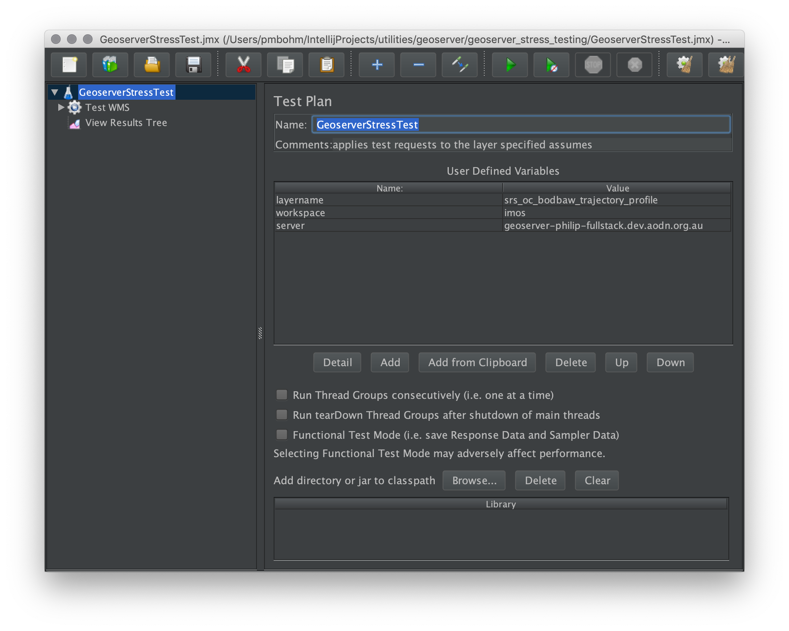
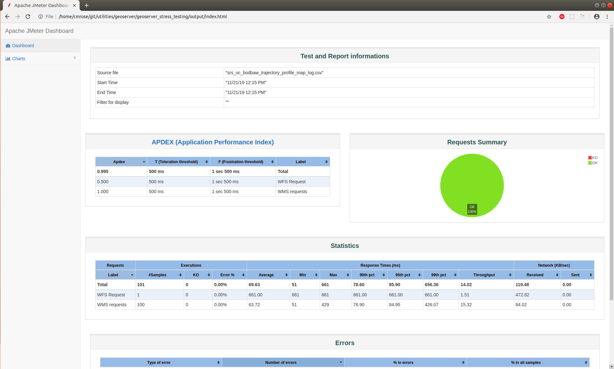

#  Testing Geoserver layer performance with Jmeter

## Setup

1. [Deploy an aodnstack](https://github.com/aodn/chef/blob/master/doc/README.pipeline-box.md#deploying-your-aws-stack) or identify a non production testing Geoserver that you can configure.
1. Configure the testing Geoserver with at least one `_map` layer you wish to test
1. Install JMeter https://jmeter.apache.org/download_jmeter.cgi
1. Git clone the [utilities repo](https://github.com/aodn/utilities)

## Configure JMeter

JMeter is a java tool with a GUI for creating sets of tests to test a servers performance. The GUI is used to define the tests while it is suggested to run the resulting tests on the command line in non-GUI mode.

1. Navigate to the `utilities/geoserver/geoserver_stress_testing` folder to run all the following commands.
1. Open the JMeter GUI to configure the preconfigured test set:

```$xslt
jmeter -t GeoserverStressTest.jmx
```

This will open the JMeter GUI
1. Change the global server, layername, workspace, configuration
    1. `server` is the domain name of the testing Geoserver (assuming a non production AWS instance)
    1. `workspace` eg: aodn or imos
    1. `layername` the WMS map layername 

 

1. Save the test plan. (File --> Save). GeoserverStressTest.jmx is now tailored ready to test your layer in the non-GUI mode
1. The current set of tests are a single WFS request with no BBOX or data limits and multiple WMS tile requests 

## Run the test plan

```bash
~/git/utilities/geoserver/geoserver_stress_testing$ jmeter -n -t GeoserverStressTest.jmx
Creating summariser <summary>
Created the tree successfully using GeoserverStressTest.jmx
Starting the test @ Thu Nov 21 11:20:04 AEDT 2019 (1574295604991)
Waiting for possible Shutdown/StopTestNow/Heapdump message on port 4445
summary =    101 in 00:00:11 =    9.1/s Avg:    58 Min:    50 Max:   310 Err:   101 (100.00%)
Tidying up ...    @ Thu Nov 21 11:20:16 AEDT 2019 (1574295616450)
... end of run

```
After the first run there will be a log file in the `utilities/geoserver/geoserver_stress_testing` folder called `[layername]_log.csv`. **Keep the log for later long term comparisons.**

The same stress test can be run repeatedly.  The corresponding log for each repetition will be appended to the log file.

## Get the graphs
The example command below uses the resulting log for the `srs_oc_bodbaw_trajectory_profile_map` layer.  It graphs all the  stress test runs. This example creates an output folder called `output` from the log file. In that folder there is a HTML page index.html to open in a browser.

```
jmeter -g srs_oc_bodbaw_trajectory_profile_map_log.csv -o output
```

In the following example the response times for the layers can be seen in the `Statistics` table.

 

To update the graphs after more stress tests
```bash
rm -rf output; 
jmeter -g srs_oc_bodbaw_trajectory_profile_map_log.csv -o output; 
xdg-open output/index.html
```

or on Mac

```bash
rm -rf output; jmeter -g srs_oc_bodbaw_trajectory_profile_map_log.csv -o output; open output/index.html
```

# GeoserverStressTest.jmx further mods

1. Change the set of WMS requests with python or by hand coding

JMeter is looping on the contents of `australiaWMS.csv` to run the WMS tile requests. australiaWMS.csv was created using `wms_request.py` to create a list of bboxes and image sizes to return. Although `wms_request.py` could be run each time to create random tests the aim would be to benchmark by running the same load each time with only remaining variable be the layer data size or complexity.


Below is the command used to populate australiaWMS.csv


`python wms_request.py -count 100 -region 94 -85 180 0 -minsize 400 300 -maxsize 600 400 -minres 0.00137329 -maxres 0.009 > australiaWMS.csv`


https://github.com/boundlessgeo/workshops/blob/master/workshops/geoserver/performance/scripts/bbox-commands.txt

